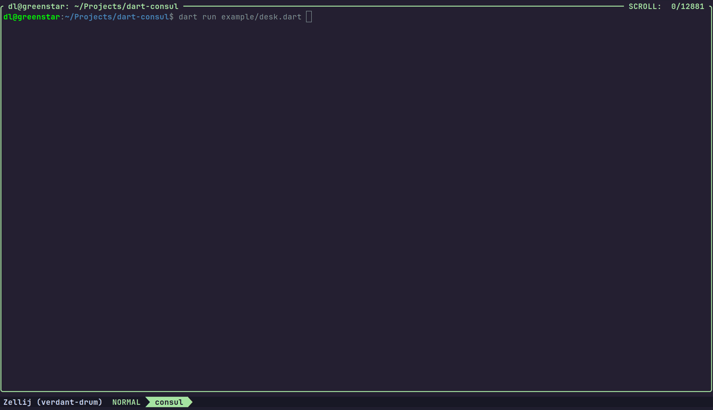

### Dart Consul - CLI "Desktop" System

There is no good reason why this exists. Another fun/joke project I picked up to learn me some more Dart. Did not mean
to take it as far as it has gotten. But will probably not take this any further... :-D ‾\_('')_/‾

Seriously, ignore this. Look at this instead: https://charm.sh/libs/ Not Dart. But makes much more sense.

#### What is this?

A very basic, limited, rudimentary, and weird "desktop windowing" system for the console/terminal. Currently tested
only on my one linux machine. Will most probably not work on Windows or macOS. Feel free to test and report back.

And it is written in Dart. Because I'm currently learning Dart to get into Flutter (and Flutter Flame) at some
point. I think. We'll see.

#### Sorry, what?

No, I'm sorry... ‾\_('')_/‾

#### So... Does it work?

Well, it works on my machine... :-D

You can try the included `example/desk.dart` and see for yourself.

The basic idea is:

```
final desktop = Desktop(...);
desktop.onKey('k', () => doSomething());

final window = Window(
  "some-id",
  "Some Title",
  size: WindowSize.defaultMinMax(Size(60, 40)),
  position: RelativePosition.fromTopLeft(xOffset: 4, yOffset: 2),
  redraw: () => "Hello, world!",
);
desktop.openWindow(window);
```

It does support a "braille" characters based "canvas". This way you can do something like the `example/desk.dart`:



#### Rationale

So one aspect I wanted to gain insight into is how fast/easy it is to add functionality for an existing,
not-entirely-trivial, code base. Here's adding moving windows via mouse as an example:

```dart
OngoingMouseAction? _onMouseEvent(MouseEvent it) {
  //...snip...
  if (isOnTitlebar(it)) {
    sendMessage(("raise-window", this));
    return MoveWindowAction(this, it, sendMessage);
  }
  //...snip...
}

class MoveWindowAction extends OngoingMouseAction {
  late final AbsolutePosition _basePosition;

  MoveWindowAction(super.window, super.event, super.sendMessage) {
    _basePosition = window.position.toAbsolute(window._desktopSize(), window.size.current);
  }

  @override
  onMouseEvent(MouseEvent event) {
    final dx = event.xAbs - this.event.xAbs;
    final dy = event.yAbs - this.event.yAbs;
    window.position = _basePosition.moved(dx, dy);
    if (event.isUp) _done = true;
  }
}
```

Now, of course there is more going on. I mentioned above: "existing code base". There is already the mouse event
dispatching implemented. And of course the entire window drawing and positioning. But my point is this: Adding
resize and move via mouse was actually kind of simple enough. Did not expect this tbh after the first few days of Dart.

This being said, it's far from being all gold... :-D I find the class modifiers (not shown in these example
snippets) super weird to use. Like... it's too much of them, isn't? :-D

Idk... probably need more time with Dart... ‾\_('')_/‾

Just for some context and closure, here's the mouse event handling (at the time of this writing):

```dart
void _handleMouseEvent(MouseEvent event) {
  final ongoing = _ongoingMouseAction;
  if (ongoing != null) {
    final p = ongoing.window.decoratedPosition(size);
    final relative = event.relativeTo(p);
    ongoing.onMouseEvent(relative);
    if (ongoing.done) _ongoingMouseAction = null;
    return;
  }

  final decorators = _windows.mapNotNull((it) => _decorators[it]);
  for (final it in decorators.reversed) {
    final p = it.decoratedPosition(size);
    final relative = event.relativeTo(p);
    final action = it.onMouseEvent(relative);
    if (action == null) continue;

    // some actions are done immediately. must not be assigned to _ongoingMouseAction.
    if (!action.done) _ongoingMouseAction = action;

    // if we have an ongoing action now, stop searching.
    break;
  }
}
```

This is fine, isn't it? Of course this is a rather trivial "desktop system". So there's that...

#### To Do

The essentials I want to be done for a "Version 1":

- [ ] Taskbar showing all (including minimized) windows
- [ ] Taskbar overflow with all remaining windows

Maybes:

- [ ] Blink(?) active (move or resize) window title (or indicate somehow else for small windows especially)
- [ ] Menubar system
- [ ] Basic dialog system
- [ ] Improve handling of terminal resize

#### Done

- [X] Draw windows
- [X] Window title bar with controls
- [X] Console input handling (keys only for now)
- [X] Tab switching
- [X] Console mouse input handling
- [X] Minimize/maximize/close windows via key
- [X] Nested key handling
- [X] Move windows via key
- [X] Resize window via keys
- [X] Window hooks (state & size for now)
- [X] Basic mouse actions (raise, minimize, maximize, close)
- [X] Resize window with mouse
- [X] Move window with mouse
- [X] Help (?) button to show key configuration

#### Bugs

- [X] *MAJOR* Titlebar controls do not respect window flags.
- [ ] *MAJOR* Moving window fast, then moving another window, moves the first one again.
- [ ] *MAJOR* Focus does not skip minimized windows properly.
- [X] *CRITICAL* One off bug for resize control. Applies only for some `Position` type it seems?
- [ ] Move overlay shown when window is too small.
- [ ] Drawing a buffer into a buffer breaks ansi in the replaced area.
  Potential fix: collect ansi sequences being replaced and add to `Cell.after` of the last cell.
  Related: should `Cell.reset` happen before `Cell.after`? seems to make more sense now.
- [ ] Related to the previous one: ansi sequences leak into the drawn parts.
- [X] Moving window out left side breaks ansi.
  Potential fix: collect all ansi sequences cut off and combine into one.
  Placing this one into the first visible cell.
